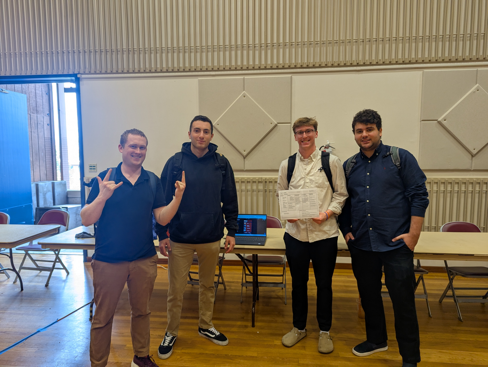

# FitForge Development Repository  

## About the Project  
This repository contains the development resources for **FitForge**, a mobile fitness application designed to help users build and maintain healthy exercise habits. FitForge is part of a **Software Engineering (CSC305)** course project, focusing on real-world software development practices, teamwork, and full-stack mobile app development.  

### Key Features  
- **Custom Workout Plans** – Create and manage personalized workout routines.  
- **Progress Tracking** – Log and visualize fitness progress over time.  
- **Habit Monitoring** – Track daily fitness-related habits for consistency.  
- **Run Tracker** – Monitor distance and time for running sessions.  
- **User-Friendly UI** – Clean and intuitive interface for seamless navigation.  

### Technologies Used  
- **Flutterflow** – Visual frontend builder for responsive UI design.  
- **Firebase** – Backend services for authentication and analytics.  
- **Firestore** – Cloud-hosted NoSQL database for user data storage.  
- **Dart** – Programming language for custom app logic and functionality.  

### Repo Maintained By  
**Elijah Smith-Antonides**  

